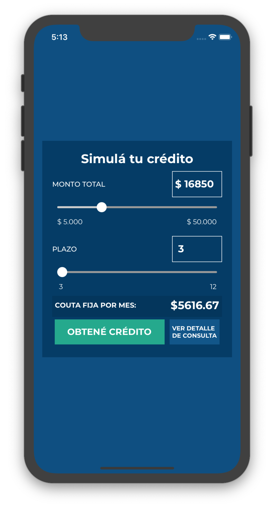

# ejericicioRNDigBang
Ejericicio hecho en React Native, usando diseño de https://github.com/digbang/ejercicio-react



Para setear el proyecto:
```bash
yarn start
cd ./ios
pod install
```

Para correr la demo en iOS:
```bash
yarn ios
```
